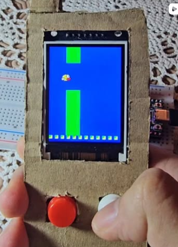

# Flappy Bird - ESP32 TFT Display Game

{ height=250px }

A Flappy Bird game implementation for ESP32 with ST7789 TFT display.

## Project Overview
This project is a Flappy Bird game that runs on an ESP32 microcontroller and displays on a 240x320 TFT screen using the ST7789 driver. The game includes:
- Classic Flappy Bird gameplay with pixel art graphics
- Button controls for flapping
- Score tracking and high score persistence
- Animated bird with wing movement
- Collision detection with pillars
- Menu system with multiple game options

## Hardware Requirements
- ESP32 development board (ESP32-DevKit, ESP32-WROOM, etc.)
- ST7789 TFT display (240x320 resolution)
- 1 push button for game controls
- Jumper wires for connections

## Pin Connections
The default pin configuration is:
- **TFT_MOSI**: 23 (SPI MOSI for display)
- **TFT_SCLK**: 18 (SPI Clock for display)
- **TFT_CS**: 5 (Chip select for display)
- **TFT_DC**: 2 (Data/Command pin for display)
- **TFT_RST**: 4 (Reset pin for display)
- **BUTTON_PIN**: 14 (Game control button)

## Software Requirements
- PlatformIO IDE or CLI
- Arduino framework
- Adafruit_GFX library
- Adafruit_ST7789 library
- EEPROM library (built-in)

## Setup Instructions

### 1. Install PlatformIO
If you haven't installed PlatformIO yet:
- For VS Code: Install the PlatformIO IDE extension

### 2. Clone/Download the Project
Clone this repository or download the project files to your local machine.

### 3. Install Dependencies
The project uses PlatformIO's library management system. Dependencies are automatically installed when you build the project.

### 4. Configure the Project
The main configuration is in `platformio.ini`:
- Board: ESP32-DevKit (can be changed to your specific ESP32 board)
- Framework: Arduino
- Libraries: Adafruit_GFX and Adafruit_ST7789

### 5. Build and Upload
- Open the project in PlatformIO
- Select your ESP32 board from the bottom status bar
- Click the "Build" button (checkmark icon) to compile
- Click the "Upload" button (right arrow icon) to flash to your ESP32

### 6. Monitor Serial Output
- Open the Serial Monitor (bug icon or Ctrl+Alt+M)
- Set baud rate to 115200
- You should see the game start and display messages

## How to Play

### Controls
- **Button (short press)**: Flap the bird (make it go up)
- **Button (long press)**: Return to main menu

### Game Mechanics
- The bird automatically falls due to gravity
- Press the button to make the bird flap and go up
- Avoid hitting the green pillars
- Score increases for each pillar passed
- Game ends when the bird hits a pillar or the ground
- High score is saved to EEPROM and persists between power cycles

## Project Structure
```
LEDSYNC/
├── platformio.ini          # PlatformIO configuration
├── src/
│   ├── main.cpp           # Main game loop and hardware setup
├── include/
│   └── README            # Include directory documentation
├── lib/
│   └── README            # Library directory documentation
├── test/
│   └── README            # Test directory documentation
└── images/
    └── screen_shot.jpg    # Project screenshot
```

## Game Features
- **Pixel Art Graphics**: Custom bird and pillar designs
- **Wing Animation**: Bird wings flap during flight
- **Dynamic Difficulty**: Pillar speed increases with score
- **Color Coding**: Pillars turn yellow when beating high score
- **Menu System**: Multiple game options (Flappy, RGB, OSC)
- **Persistent Storage**: High scores saved to EEPROM

## Customization Options
You can modify the game behavior by changing constants in `main.cpp`:
- `TFT_WIDTH`, `TFT_HEIGHT`: Display resolution
- `DRAW_LOOP_INTERVAL`: Game speed
- `BUTTON_PIN`: Control button pin
- `BLUE_SKY`: Background color
- Gravity and fall rate values

## Troubleshooting
- **Build errors**: Ensure all libraries are installed and up to date
- **Upload failures**: Check USB connection and correct board selection
- **Display issues**: Verify wiring connections and pin assignments
- **Button problems**: Check button wiring and debounce settings

## License
This project is open source. See the LICENSE file for details.

## Contributing
Feel free to submit issues and enhancement requests!